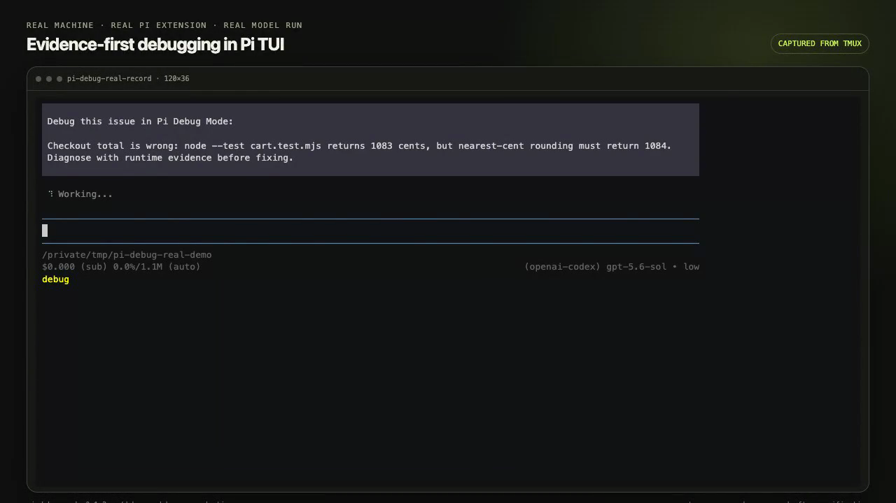

# pi-debug-mode

Evidence-first debugging workflow for [Pi](https://github.com/earendil-works/pi-mono), inspired by Cursor Debug Mode.

It guides Pi through competing hypotheses, targeted runtime instrumentation, human reproduction, evidence-backed fixes, and final verification. Canonical source: [github.com/liush2yuxjtu/pi-debug-mode](https://github.com/liush2yuxjtu/pi-debug-mode).

## Real TUI demo

[](artifacts/demo/pi-debug-mode-real-tui.mp4)

[Watch the real Pi TUI recording](artifacts/demo/pi-debug-mode-real-tui.mp4). It captures a live `/debug` run on a real machine with the published extension and `openai-codex/gpt-5.6-sol`: hypothesis generation, temporary `pi-debug` probes, the interactive `debug_reproduction` checkpoint, evidence inspection, the smallest fix, human verification, probe cleanup, and the final passing test.

The source terminal session was recorded from tmux as an asciinema cast. Only long human-wait intervals were compressed; TUI output and tool execution remain from the live run.

For a short conceptual preview, [watch the 13-second product demo](artifacts/demo/pi-debug-mode-demo.mp4) or open the [interactive local demo](docs/demo.html). That shorter preview is a deterministic simulation.

## Install

```bash
pi install npm:pi-debug-mode
```

Or install directly from GitHub:

```bash
pi install git:github.com/liush2yuxjtu/pi-debug-mode
```

Restart Pi, then run:

```text
/debug describe the bug and expected behavior
```

At each checkpoint, `debug_reproduction` shows exact steps and three choices:

1. `Fixed`
2. `Issue reproduced, please try again`
3. `Type prompt…`

If `/debug` is invoked while Pi is busy, it waits for the current agent work to fully settle before starting the debug task. It never steers the active turn.

Use `/debug-stop` to leave debug mode without claiming a fix.

## Uninstall

```bash
pi remove npm:pi-debug-mode
```

For a GitHub install:

```bash
pi remove git:github.com/liush2yuxjtu/pi-debug-mode
```

## How it works

1. Inspect the real execution path and list competing hypotheses.
2. Add minimal `pi-debug` runtime probes that distinguish them.
3. Ask for one exact reproduction through an interactive checkpoint.
4. Read captured evidence and apply the smallest root-cause fix.
5. Verify once more, then remove every temporary probe.

## Permissions and security

Pi extensions run with the same system permissions as Pi. This package adds two commands and one interactive tool; it does not start background services, send telemetry, or make network requests. Debug sessions may ask Pi to add temporary runtime probes and read local logs. Review proposed tool calls and avoid reproducing bugs with secrets in inputs or logs.

Report vulnerabilities privately through [GitHub Security Advisories](https://github.com/liush2yuxjtu/pi-debug-mode/security/advisories/new). For normal bugs and support, use [GitHub Issues](https://github.com/liush2yuxjtu/pi-debug-mode/issues).

## Sources

- [Cursor Debug Mode docs](https://cursor.com/for/debugging)
- [Cursor Debug Mode announcement](https://cursor.com/blog/debug-mode)

## License

MIT
